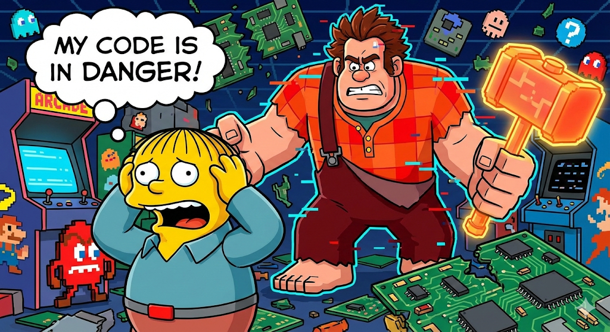

<p align="center">
  
</p>

## ⚡ Quickstart: Run Ralph Loops Now

Want to run Ralph Wiggum loops right now? You need LLM API access. Ralph uses a lot of tokens, which gets expensive quickly.

[Zai Coding Plan](https://z.ai/subscribe?ic=F8BPSXJHOC) is a great way to get access to a lot of tokens for a low price.

**[Zai Coding Plan](https://z.ai/subscribe?ic=F8BPSXJHOC)** — starts at $3/month, works with Claude Code, Amp, Cline, and 10+ coding tools. This link gets you **10% off** (full disclosure: I'm [@mikehostetler](https://github.com/mikehostetler) and by using this link you help support my work on Wreckit).

```bash
npm install -g wreckit && wreckit init
wreckit ideas < YOUR_IDEAS.md
wreckit  # go touch grass
```

Once you have API access, you can set up Claude Code to use the Zai API:

👉 [Claude Code setup instructions](https://docs.z.ai/devpack/tool/claude)

---

# Wreck it Ralph Wiggum 🔨

> _"I'm gonna wreck it!"_ — Wreck-It Ralph  
> _"I'm in danger."_ — Ralph Wiggum, also your codebase

**Your AI agent, unsupervised, wrecking through your backlog while you sleep.**

```bash
wreckit ideas < BACKLOG.md && wreckit  # go touch grass
```

---

## What Is This

A CLI that runs a **Ralph Wiggum Loop** over your roadmap:

```
ideas → research → plan → implement → PR → done
       └──────────────────────────────────┘
         "I'm helping!" — the agent, probably
```

You dump a text file of half-baked ideas. Wreckit turns them into researched, planned, implemented, and PR'd code. You review. Merge. Ship.

It's the [HumanLayer](https://github.com/humanlayer/humanlayer) **Research → Plan → Implement** workflow, fully automated. The agent researches your codebase, writes a detailed plan, then executes it story-by-story until there's a PR ready for your review.

**Files are truth.** Everything lives in `.wreckit/` as JSON and Markdown. Git-trackable. Inspectable. Resumable. No magic databases. No cloud sync. Just files.

---

## Quick Start

```bash
# Install the chaos
npm install -g wreckit

# Initialize in your repo
cd my-project
wreckit init

# Feed it ideas (literally anything)
wreckit ideas < IDEAS.md
# or: echo "add dark mode" | wreckit ideas
# or: wreckit ideas --file ROADMAP.md

# Let Ralph loose
wreckit

# Go do something else. Come back to PRs.
```

---

## The Loop

Each item progresses through states:

```
idea → researched → planned → implementing → critique → in_pr/done
```

| State          | What Happened                                          |
| -------------- | ------------------------------------------------------ |
| `idea`         | Ingested, waiting for attention                        |
| `researched`   | Agent analyzed codebase, wrote `research.md`           |
| `planned`      | Agent created `plan.md` + `prd.json` with user stories |
| `implementing` | Agent coding through stories, committing as it goes    |
| `critique`     | Agent reviews its own work, runs tests, checks quality |
| `in_pr`        | PR opened, awaiting your review (PR mode only)         |
| `done`         | Merged. Ralph did it.                                  |

### The Workflow

1. **Research** — Agent reads your codebase thoroughly. Finds patterns. Documents file paths, conventions, integration points. Outputs `research.md`.

2. **Plan** — Agent designs the solution. Breaks it into phases with success criteria. Creates user stories with acceptance criteria. Outputs `plan.md` + `prd.json`.

3. **Implement** — Agent picks the highest priority story, implements it, runs tests, commits, marks it done. Repeats until all stories complete.

4. **Critique** — Agent reviews its own work: runs tests, checks types, verifies end-to-end behavior. Rejects substandard work and sends it back for re-implementation.

5. **PR** — Agent opens a pull request. You review. You merge. You ship.

### Merge Modes

Wreckit supports two merge strategies, configured via `merge_mode` in `.wreckit/config.json`:

**PR Mode** (`"pr"`, default):
- Creates a feature branch per item
- Opens a GitHub PR when implementation completes
- You review, approve, merge
- Requires `gh` CLI and a GitHub remote

**Direct Mode** (`"direct"`):
- Merges directly to the base branch without PRs — YOLO mode
- Great for greenfield projects, solo devs, or local-only repos
- Works without a GitHub remote (no `gh` CLI needed)
- Includes safety features:
  - **Anti-clobber**: After merge, restores other items' state files from pre-merge SHA
  - **Stash-on-switch**: Automatically stashes uncommitted changes before branch switches
  - **Merge conflict recovery**: Aborts failed merges and returns to the feature branch
  - **Rollback**: Use `wreckit rollback <id>` to undo a direct-merge

```json
{
  "merge_mode": "direct",
  "pr_checks": {
    "allow_unsafe_direct_merge": true
  }
}
```

---

## CLI Commands

### The Essentials

| Command                | What It Does                        |
| ---------------------- | ----------------------------------- |
| `wreckit`              | Run everything. TUI shows progress. |
| `wreckit init`         | Initialize `.wreckit/` in repo      |
| `wreckit ideas < FILE` | Ingest ideas from stdin             |
| `wreckit status`       | List all items with state           |
| `wreckit run <id>`     | Run single item through all phases  |
| `wreckit next`         | Run the next incomplete item        |
| `wreckit rollback <id>`| Undo a direct-merge item            |
| `wreckit doctor`       | Validate items, find issues         |

### Phase Commands (for debugging)

| Command                  | Transition             |
| ------------------------ | ---------------------- |
| `wreckit research <id>`  | idea → researched      |
| `wreckit plan <id>`      | researched → planned   |
| `wreckit implement <id>` | planned → implementing |
| `wreckit pr <id>`        | implementing → in_pr   |
| `wreckit complete <id>`  | in_pr → done           |

### Flags

| Flag        | What                                      |
| ----------- | ----------------------------------------- |
| `--sandbox` | Run in isolated Firecracker VM            |
| `--verbose` | More logs                                 |
| `--quiet`   | Errors only                               |
| `--no-tui`  | Disable TUI (CI mode)                     |
| `--dry-run` | Preview, don't execute                    |
| `--force`   | Regenerate artifacts                      |
| `--debug`   | JSON output (ndjson)                      |
| `--cwd <path>` | Override working directory             |

### Meta-Agents

Wreckit includes specialized agents that operate on the system itself:

| Command | Agent | Purpose |
|---------|-------|---------|
| `wreckit dream` | **Dreamer** | Scans the codebase for TODOs, gaps, and tech debt to generate new roadmap items |
| `wreckit strategy` | **Strategy** | Analyzes project state to recommend the next best action |
| `wreckit learn` | **Learn** | Extracts reusable patterns from completed items into skills |
| `wreckit geneticist` | **Geneticist** | Analyzes healing logs to optimize system prompts via PRs |

---

## Sandbox Mode

**Sandbox mode** runs your agent in an isolated Firecracker microVM, automatically syncing files back and forth. This is the safest way to run untrusted code or risky operations.

### Quick Start

```bash
# Run a single item in sandbox mode
wreckit run 079-sandbox-usability-layer --sandbox

# Run all phases in sandbox mode
wreckit research 079-sandbox-usability-layer --sandbox
wreckit plan 079-sandbox-usability-layer --sandbox
wreckit implement 079-sandbox-usability-layer --sandbox

# Run everything in sandbox mode
wreckit --sandbox
```

### What Sandbox Mode Does

When you use `--sandbox`, Wreckit:

1. **Spawns a Firecracker VM** — Creates an isolated microVM via Sprite
2. **Syncs your project** — Pushes your code to the VM before execution
3. **Runs the agent** — Executes in complete isolation
4. **Pulls back changes** — Syncs modified files back to your machine on success
5. **Cleans up** — Automatically destroys the VM when done

### Why Use Sandbox Mode?

- **Safety**: Run risky code (file operations, network requests, system commands) in isolation
- **Clean environments**: Each sandbox starts fresh, no leftover state
- **Parallel execution**: Run multiple sandboxes simultaneously without conflicts
- **Reproducibility**: Same VM config every time

### Requirements

- **Sprite CLI** — Install from [sprites.dev](https://sprites.dev/)
- **Sprites.dev account** — Free tier available for testing
- **Sufficient resources** — Each VM uses ~512MiB RAM by default

### How It Works

**VM Lifecycle:**
```
1. Auto-generate VM name: wreckit-sandbox-<item-id>-<timestamp>
2. Start VM with Sprite CLI
3. Push project files to VM (excludes: .git, node_modules, .wreckit, dist, build)
4. Run agent in VM
5. On success: Pull modified files back from VM
6. Destroy VM (ephemeral cleanup)
```

**Interrupt Safety:**
- Press `Ctrl+C` once → Graceful shutdown with VM cleanup
- Press `Ctrl+C` twice → Force exit (if cleanup hangs)

**Bi-directional Sync:**
- Files modified in the VM are pulled back automatically on success
- Excludes: `.git`, `node_modules`, `.wreckit`, `dist`, `build`, `.DS_Store`

### Advanced: Manual VM Management

For power users who want persistent VMs or manual control:

```bash
# List running VMs
wreckit sprite list

# Start a VM manually
wreckit sprite start my-vm

# Execute commands in a VM
wreckit sprite exec my-vm -- npm test

# Pull files from VM
wreckit sprite pull my-vm

# Kill a VM
wreckit sprite kill my-vm

# Attach to a VM (interactive shell)
wreckit sprite attach my-vm
```

**When to use manual VM management:**
- You want a persistent VM for multiple runs
- You need to debug inside the VM
- You want to run custom commands before/after agent execution
- You're running many operations and don't want to restart the VM each time

### Configuration

You can also configure sandbox mode in `.wreckit/config.json`:

```json
{
  "agent": {
    "kind": "sprite",
    "wispPath": "sprite",
    "syncEnabled": true,
    "syncOnSuccess": true,
    "maxVMs": 5,
    "defaultMemory": "512MiB",
    "defaultCPUs": "1"
  }
}
```

**However, using `--sandbox` is recommended** because it:
- Automatically sets sensible defaults
- Enables ephemeral mode (auto-cleanup)
- Enables bi-directional sync
- Works with any agent configuration

### Troubleshooting

**VM fails to start:**
```bash
# Check Sprite CLI is installed
sprite --version

# Verify authentication
sprite auth status

# Check available VMs
wreckit sprite list
```

**Files not syncing back:**
- Ensure `syncOnSuccess: true` in config (automatic with `--sandbox`)
- Check that files aren't in exclude patterns
- Run with `--verbose` to see sync logs

**Orphaned VMs:**
```bash
# List all VMs
wreckit sprite list

# Kill orphaned VMs
wreckit sprite kill <vm-name>
```

---

## Configuration

Lives in `.wreckit/config.json`:

```json
{
  "schema_version": 1,
  "base_branch": "main",
  "branch_prefix": "wreckit/",
  "merge_mode": "pr",
  "agent": {
    "kind": "claude_sdk",
    "model": "claude-sonnet-4-20250514"
  },
  "max_iterations": 100,
  "timeout_seconds": 3600
}
```

### Agent Options

Wreckit supports multiple agent execution backends:

| Kind           | Description                    | Configuration                    |
| -------------- | ------------------------------ | -------------------------------- |
| `claude_sdk`   | Claude Agent SDK (recommended) | model, max_tokens, tools         |
| `amp_sdk`      | Amp SDK (experimental)         | model (optional)                 |
| `codex_sdk`    | Codex SDK (experimental)       | model (default: codex-1)         |
| `opencode_sdk` | OpenCode SDK (experimental)    | none                             |
| `process`      | External CLI process           | command, args, completion_signal |

#### Claude SDK Mode (Recommended)

Uses the Claude Agent SDK directly for best performance and error handling:

```json
{
  "agent": {
    "kind": "claude_sdk",
    "model": "claude-sonnet-4-20250514",
    "max_tokens": 8192
  }
}
```

#### Experimental SDK Modes

Wreckit also supports experimental SDK integrations. These use the same underlying SDK infrastructure and share authentication/environment variable resolution with `claude_sdk`.

> **Note:** Experimental SDKs may have API changes in future releases.

**Amp SDK:**

```json
{
  "agent": {
    "kind": "amp_sdk",
    "model": "custom-model"
  }
}
```

**Codex SDK:**

```json
{
  "agent": {
    "kind": "codex_sdk",
    "model": "codex-1"
  }
}
```

**OpenCode SDK:**

```json
{
  "agent": {
    "kind": "opencode_sdk"
  }
}
```

#### Process Mode

Spawns an external CLI process (for backward compatibility or custom agents):

**Amp CLI:**

```json
{
  "agent": {
    "kind": "process",
    "command": "amp",
    "args": ["--dangerously-allow-all"],
    "completion_signal": "<promise>COMPLETE</promise>"
  }
}
```

**Claude CLI:**

```json
{
  "agent": {
    "kind": "process",
    "command": "claude",
    "args": ["--dangerously-skip-permissions", "--print"],
    "completion_signal": "<promise>COMPLETE</promise>"
  }
}
```

See [MIGRATION.md](./MIGRATION.md) for detailed configuration and environment variable documentation.

---

## Folder Structure

```
.wreckit/
├── config.json              # Global config
├── prompts/                 # Customizable prompt templates
│   ├── research.md
│   ├── plan.md
│   ├── implement.md
│   └── critique.md
└── items/
    └── <nnn>-<slug>/
        ├── item.json        # State and metadata
        ├── research.md      # Codebase analysis
        ├── plan.md          # Implementation plan
        ├── prd.json         # User stories
        ├── prompt.md        # Generated agent prompt
        └── progress.log     # What the agent learned
```

---

## Customization

### Prompt Templates

Edit files in `.wreckit/prompts/` to customize agent behavior:

- `research.md` — How the agent analyzes your codebase
- `plan.md` — How it designs solutions
- `implement.md` — How it executes user stories
- `critique.md` — How the agent reviews and quality-checks its work

### Template Variables

| Variable                | Description                              |
| ----------------------- | ---------------------------------------- |
| `{{id}}`                | Item ID (e.g., `features/001-dark-mode`) |
| `{{title}}`             | Item title                               |
| `{{section}}`           | Section name                             |
| `{{overview}}`          | Item description                         |
| `{{item_path}}`         | Path to item folder                      |
| `{{branch_name}}`       | Git branch name                          |
| `{{base_branch}}`       | Base branch                              |
| `{{completion_signal}}` | Agent completion signal                  |
| `{{research}}`          | Contents of research.md                  |
| `{{plan}}`              | Contents of plan.md                      |
| `{{prd}}`               | Contents of prd.json                     |
| `{{progress}}`          | Contents of progress.log                 |

---

## Example Session

```bash
$ cat IDEAS.md
Add dark mode toggle
Fix the login timeout bug
Migrate auth to OAuth2

$ wreckit ideas < IDEAS.md
Created 3 items:
  features/001-dark-mode-toggle
  bugs/001-login-timeout
  infra/001-oauth2-migration

$ wreckit status
ID                              STATE
features/001-dark-mode-toggle   raw
bugs/001-login-timeout          raw
infra/001-oauth2-migration      raw

$ wreckit
# TUI runs, agent researches, plans, implements...
# You go do literally anything else

$ wreckit status
ID                              STATE     PR
features/001-dark-mode-toggle   in_pr     #42
bugs/001-login-timeout          in_pr     #43
infra/001-oauth2-migration      implementing

$ # Review PRs, merge, done
```

---

## Design Principles

1. **Files are truth** — JSON + Markdown, git-trackable
2. **Idempotent** — Re-run anything safely
3. **Resumable** — Ctrl-C and pick up where you left off
4. **Transparent** — Every prompt is inspectable and editable
5. **Recoverable** — `wreckit doctor --fix` repairs broken state

---

## Cloud Sandboxes

Wreckit is designed for **multi-actor parallelism** — spin up multiple sandboxes, each working on different items from the same repo. The file-based state in `.wreckit/` means no conflicts, no coordination headaches.

We recommend [Sprites](https://sprites.dev/) from Fly.io for cloud dev environments. Spin up a fleet of Ralphs, let them wreck in parallel.

```bash
# Each sandbox pulls the repo, runs one item
wreckit next  # grabs the next incomplete item, runs it
```

---

## Requirements

- Bun 1.0+ (or Node.js 18+)
- `gh` CLI (only needed for PR mode — direct mode works without GitHub)
- An AI agent:
  - **SDK Mode** (recommended):
    - **Direct API**: `export ANTHROPIC_API_KEY=sk-ant-...`
    - **Custom endpoint** (e.g., Zai): Set `ANTHROPIC_BASE_URL` and `ANTHROPIC_AUTH_TOKEN`
    - Verify setup: `wreckit sdk-info`
    - See [MIGRATION.md#environment-variables](./MIGRATION.md#environment-variables) for full details
  - **Process Mode**: [Amp](https://ampcode.com) or [Claude](https://claude.ai) CLI

---

## Development

```bash
git clone https://github.com/mikehostetler/wreckit.git
cd wreckit
bun install
bun run build
bun run test
```

---

## Exit Codes

| Code | Meaning              |
| ---- | -------------------- |
| 0    | Success              |
| 1    | Error                |
| 130  | Interrupted (Ctrl-C) |

---

## Acknowledgements

The "Ralph Wiggum Loop" methodology stands on the shoulders of giants:

- [Ryan Carson](https://x.com/ryancarson) — for the Ralph pattern that inspired the core loop
- [Geoff Huntley](https://x.com/GeoffreyHuntley) — for evangelizing the Ralph Wiggum agent pattern
- [Dexter Horthy](https://x.com/dexhorthy) and the entire [HumanLayer](https://humanlayer.dev) team — for the Research → Plan → Implement workflow that makes agents actually useful
- Everyone in the community teaching agents to stop vibing and start shipping

---

## License

MIT

---

_"My code is in danger!"_ — your codebase, nervously
