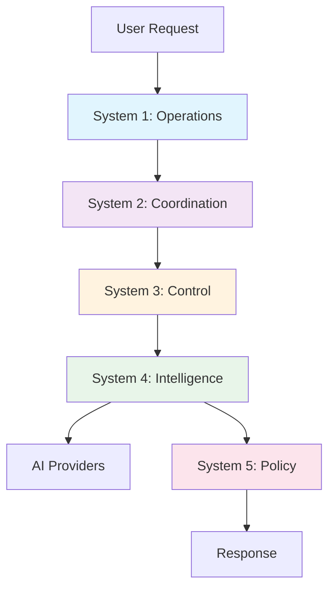

# Cybernetic aMCP Framework

<div align="center">


**A distributed AI orchestration system implementing the Viable System Model for intelligent multi-agent coordination**

[Get Started](#-quick-start) • [Documentation](#-documentation) • [API Reference](api/overview.md) • [GitHub](https://github.com/jmanhype/cybernetic-amcp)

</div>

---

## 🎯 Overview

The Cybernetic aMCP Framework is a cutting-edge distributed system that orchestrates multiple AI providers through a cybernetics-inspired architecture. Built on Elixir's fault-tolerant OTP platform, it implements Stafford Beer's Viable System Model (VSM) to create a self-regulating, adaptive AI coordination system.

### What Makes It Different?

Unlike traditional AI integration approaches, Cybernetic aMCP treats your AI infrastructure as a living organism that can:
- **Self-heal** when providers fail
- **Self-optimize** based on performance metrics
- **Self-govern** through policy enforcement
- **Self-adapt** to changing workloads

## ✨ Key Features

### 🧠 **Intelligent Multi-Provider AI Orchestration**
Seamlessly route requests across multiple AI providers with automatic failover and load balancing.

```elixir
# Automatically routes to the best available provider
{:ok, response} = Cybernetic.VSM.System4.analyze(
  episode,
  context: context,
  providers: [:anthropic, :openai, :ollama]
)
```

### 🔄 **Viable System Model Architecture**
Five interconnected subsystems ensure organizational viability:

| System | Purpose | Key Features |
|--------|---------|--------------|
| **S1** Operations | Day-to-day task execution | Telegram bot, API handlers |
| **S2** Coordination | Conflict prevention | Load balancing, resource allocation |
| **S3** Control | Resource optimization | Rate limiting, circuit breakers |
| **S4** Intelligence | Environmental scanning | AI routing, pattern recognition |
| **S5** Policy | Strategic governance | SOP management, compliance |

### 🛡️ **Enterprise-Grade Reliability**
- **Circuit Breakers**: Automatic failure isolation
- **Rate Limiting**: Token bucket algorithm with overflow handling
- **CRDT State**: Conflict-free distributed state management
- **Health Monitoring**: Real-time system health tracking

### 📊 **Comprehensive Observability**
- OpenTelemetry distributed tracing
- Prometheus metrics collection
- Grafana visualization dashboards
- Custom telemetry events

## 🚀 Quick Start

### Prerequisites

- Elixir 1.14+
- Docker & Docker Compose
- RabbitMQ 3.11+
- PostgreSQL 14+

### Installation

```bash
# Clone the repository
git clone https://github.com/jmanhype/cybernetic-amcp.git
cd cybernetic-amcp

# Install dependencies
mix deps.get

# Start infrastructure services
docker-compose -f config/docker/docker-compose.yml up -d

# Configure environment variables
cp .env.example .env
# Edit .env with your API keys

# Run the application
iex -S mix
```

### Basic Usage

```elixir
# Start a simple AI conversation
{:ok, session} = Cybernetic.start_session()

{:ok, response} = Cybernetic.query(session, %{
  prompt: "Explain quantum computing",
  provider: :auto,  # Automatic provider selection
  max_tokens: 1000
})

IO.puts(response.content)
```

## 🏗️ Architecture

### System Flow



### Technology Stack

<div class="grid">
  <div class="card">
    <h4>🔧 Core</h4>
    <ul>
      <li>Elixir/Erlang OTP</li>
      <li>Phoenix Framework</li>
      <li>RabbitMQ (AMQP)</li>
      <li>PostgreSQL</li>
    </ul>
  </div>
  <div class="card">
    <h4>🤖 AI Providers</h4>
    <ul>
      <li>Anthropic Claude</li>
      <li>OpenAI GPT</li>
      <li>Together AI</li>
      <li>Ollama (Local)</li>
    </ul>
  </div>
  <div class="card">
    <h4>📊 Monitoring</h4>
    <ul>
      <li>OpenTelemetry</li>
      <li>Prometheus</li>
      <li>Grafana</li>
      <li>Jaeger</li>
    </ul>
  </div>
</div>

## 📚 Documentation

### Getting Started
- [Installation Guide](getting-started/installation.md)
- [Configuration](getting-started/configuration.md)
- [Your First Query](getting-started/first-query.md)

### Core Concepts
- [Viable System Model](concepts/vsm.md)
- [Circuit Breakers](concepts/circuit-breakers.md)
- [CRDT State Management](concepts/crdt.md)
- [Message Flow](concepts/message-flow.md)

### API Reference
- [System APIs](api/systems.md)
- [Provider APIs](api/providers.md)
- [MCP Tools](api/mcp-tools.md)
- [Telemetry Events](api/telemetry.md)

### Deployment
- [Docker Deployment](deployment/docker.md)
- [Kubernetes Deployment](deployment/kubernetes.md)
- [Production Considerations](deployment/production.md)

## 🎮 Interactive Demo

Try the Cybernetic aMCP Framework in action:

```elixir
# Demo: Intelligent routing with fallback
mix run scripts/demo/demo_s4_routing.exs

# Demo: Policy enforcement
mix run scripts/demo/demo_policy_intelligence.exs

# Demo: Full system validation
mix run scripts/prove/prove_entire_system.exs
```

## 🤝 Contributing

We welcome contributions! See our [Contributing Guide](contributing.md) for details.

### Development Setup

```bash
# Run tests
mix test

# Run with observer
iex --name cybernetic@localhost -S mix

# Generate documentation
mix docs
```

## 📈 Performance

<div class="benchmark">
  <table>
    <tr>
      <th>Metric</th>
      <th>Value</th>
      <th>Notes</th>
    </tr>
    <tr>
      <td>Request Throughput</td>
      <td>10,000+ req/s</td>
      <td>With connection pooling</td>
    </tr>
    <tr>
      <td>AI Provider Failover</td>
      <td>&lt; 100ms</td>
      <td>Circuit breaker activation</td>
    </tr>
    <tr>
      <td>State Synchronization</td>
      <td>&lt; 50ms</td>
      <td>CRDT merge operations</td>
    </tr>
    <tr>
      <td>Message Queue Latency</td>
      <td>&lt; 10ms</td>
      <td>RabbitMQ with persistence</td>
    </tr>
  </table>
</div>

## 🔐 Security

- JWT-based authentication
- API key rotation support
- Role-based access control (RBAC)
- Encrypted communication channels
- Audit logging

## 📜 License

This project is licensed under the MIT License - see the [LICENSE](https://github.com/jmanhype/cybernetic-amcp/blob/main/LICENSE) file for details.

## 🌟 Star History

[](https://star-history.com/#jmanhype/cybernetic-amcp&Date)

---

<div align="center">
  <strong>Built with ❤️ by the Cybernetic Team</strong>
  <br>
  <a href="https://github.com/jmanhype/cybernetic-amcp">GitHub</a> •
  <a href="https://twitter.com/cybernetic_ai">Twitter</a> •
  <a href="https://discord.gg/cybernetic">Discord</a>
</div>