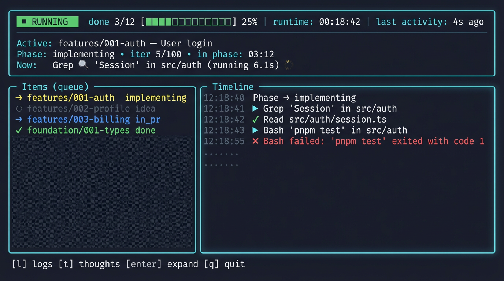

# TUI UX Design

> User experience design for the wreckit Terminal User Interface redesign.

## Design Philosophy

The wreckit TUI is a **status + exception dashboard** for monitoring autonomous agents. Users are typically:

- **Glancing periodically** while multitasking
- **Looking for problems** (stuck, errors, needs input)
- **Checking progress** toward completion
- **Rarely reading** detailed output unless something is wrong

### Core Principle

> Show *what it's doing now*, *whether it's making progress*, and *what needs human attention*.  
> Everything else is progressive disclosure behind toggles.

---

## Information Hierarchy

### Tier 1: "Am I OK?" (Always Visible, Top)

Readable in 2-3 seconds while glancing:

| Element | Purpose | Example |
|---------|---------|---------|
| **Run State** | Global health at a glance | `RUNNING` / `PAUSED` / `ERROR` / `DONE` |
| **Last Activity** | Best "stuck" detector | `last activity: 4s ago` |
| **Progress** | How far along | `done 3/12 ███████░░░` |
| **Runtime** | Total elapsed | `00:18:42` |
| **Active Item** | What's being worked on | `features/001-auth — User login` |
| **Phase + Iteration** | Where in the workflow | `implementing • iter 5/100` |
| **Phase Duration** | Spot loops/hangs | `in phase: 03:12` |
| **Current Action** | What's happening NOW | `Now: Grep 🔍 "Session" in src/auth` |

### Tier 2: "What Just Happened?" (Main Area)

This is where users decide "continue vs intervene":

| Element | Purpose |
|---------|---------|
| **Items Queue** | Overview of all items and their states |
| **Timeline** | Chronological feed of meaningful events (phase changes, tool calls, errors) |

### Tier 3: "Details When I Care" (Toggled)

| Element | Key | Purpose |
|---------|-----|---------|
| **Logs** | `l` | Raw agent output for deep debugging |
| **Thoughts** | `t` | Agent reasoning/planning text |
| **Tool Detail** | `Enter` | Expand last tool input/output |

---

## Visual Mockup



### Layout Structure

```
┌─────────────────────────────────────────────────────────────────────────────┐
│ RUNNING   done 3/12 ███████░░░  00:18:42   last activity: 4s ago           │
├─────────────────────────────────────────────────────────────────────────────┤
│ Active: features/001-auth — User login                                      │
│  Phase: implementing • iter 5/100 • in phase: 03:12                         │
│    Now: Grep 🔍 "Session" in src/auth (running 6.1s)                        │
├──────────── Items (queue) ─────────┬──────────── Timeline ──────────────────┤
│ → features/001-auth  implementing  │ 12:18:40 Phase → implementing          │
│ ○ features/002-profile idea        │ 12:18:41 ▶ Grep "Session" ...          │
│ → features/003-billing in_pr       │ 12:18:42 ✓ Read src/auth/...           │
│ ✓ foundation/001-types done        │ 12:18:43 ▶ Bash "pnpm test" ...        │
│                                    │ 12:18:55 ✗ Bash failed: exit 1         │
├─────────────────────────────────────────────────────────────────────────────┤
│ [l] logs  [t] thoughts  [enter] expand  [q] quit                            │
└─────────────────────────────────────────────────────────────────────────────┘
```

---

## Key Features

### 1. "Now" Line

The single most important element - shows current action in real-time:

```
Now: Grep 🔍 "Session" in src/auth (running 6.1s)
```

When completed:
```
✓ Grep found 12 matches (0.8s)
```

### 2. Timeline (Replaces Tool Calls + Thoughts)

A chronological feed of **meaningful events only**:

| Event Type | Format |
|------------|--------|
| Phase change | `12:18:40 Phase → implementing` |
| Tool start | `12:18:41 ▶ Grep "Session" ...` |
| Tool complete | `12:18:42 ✓ Read src/auth/...` |
| Tool error | `12:18:55 ✗ Bash failed: exit 1` |
| Decision | `12:19:00 📋 Created plan with 3 stories` |

### 3. Stall Detection

If activity stops unexpectedly:

```
┌─────────────────────────────────────────────────────────────────────────────┐
│ ⚠️ STALL?   done 3/12 ███████░░░  00:18:42   last activity: 45s ago        │
├─────────────────────────────────────────────────────────────────────────────┤
│ Active: features/001-auth — User login                                      │
│  Phase: implementing • iter 5/100 • in phase: 03:12                         │
│    Now: Bash "pnpm test" (running 42s)  ⚠️ longer than expected             │
```

**Thresholds** (configurable):
- General: `> 30s` since last activity
- Bash commands: `> 20s`
- Read/Write: `> 10s`
- Network tools: `> 30s`

### 4. Error Banner

When failures occur, show prominently at top:

```
┌─────────────────────────────────────────────────────────────────────────────┐
│ ✗ ERROR   done 3/12 ███████░░░  00:18:42                                   │
├─ Bash failed (exit 1): npm ERR! Test failed                                ─┤
│ Press [l] for logs • [r] retry • [s] skip • [q] quit                        │
├─────────────────────────────────────────────────────────────────────────────┤
```

### 5. Input Required

When agent needs user input:

```
┌─────────────────────────────────────────────────────────────────────────────┐
│ ❓ INPUT REQUIRED                                                           │
├─────────────────────────────────────────────────────────────────────────────┤
│ The agent needs your input:                                                 │
│                                                                             │
│ "Should I use PostgreSQL or SQLite for the database?"                       │
│                                                                             │
│ > _                                                                         │
└─────────────────────────────────────────────────────────────────────────────┘
```

---

## Keyboard Shortcuts

### Primary Actions

| Key | Action | Notes |
|-----|--------|-------|
| `q` | Quit | With confirmation if running |
| `l` | Toggle logs view | Full raw output |
| `t` | Toggle thoughts view | Agent reasoning |
| `Enter` | Expand last tool | Show full input/output |

### Navigation (Logs/Thoughts View)

| Key | Action |
|-----|--------|
| `j` / `↓` | Scroll down |
| `k` / `↑` | Scroll up |
| `g` | Jump to top |
| `G` | Jump to bottom (follow mode) |
| `PageUp/Down` | Page scroll |

### Future Enhancements

| Key | Action | Status |
|-----|--------|--------|
| `↑/↓` | Select item (in items view) | Planned |
| `/` | Search logs | Planned |
| `f` | Filter timeline | Planned |
| `r` | Retry failed item | Planned |
| `s` | Skip current item | Planned |

---

## Color System

### State Colors

| State | Color | Icon |
|-------|-------|------|
| Running | Yellow | `→` |
| Done | Green | `✓` |
| Error | Red | `✗` |
| Pending | Dim/Gray | `○` |
| In PR | Blue | `→` |

### Status Badge Colors

| Status | Background | Text |
|--------|------------|------|
| `RUNNING` | Green | White |
| `PAUSED` | Yellow | Black |
| `ERROR` | Red | White |
| `DONE` | Green | White |
| `STALL?` | Yellow | Black |

### Semantic Colors

| Element | Color |
|---------|-------|
| Borders | Cyan |
| Labels | Dim/Gray |
| Active item | Yellow + Bold |
| Timestamps | Dim/Gray |
| Error text | Red |
| Success | Green |

---

## What's Removed/Demoted

### Demoted to Toggle

| Element | Reason |
|---------|--------|
| **Thoughts stream** | High noise, rarely actionable |
| **Full tool list** | Compressed into timeline |
| **Tool input JSON** | Summarized, expandable |

### Removed from Default View

| Element | Reason | Alternative |
|---------|--------|-------------|
| **Workflow rail** | Takes space, rarely referenced | Show phase number: `Phase 4/7` |
| **Story in header** | Often empty/noise | Show only in item details |
| **20 recent tools** | Information overload | Timeline with 8-12 events |

---

## Progressive Disclosure Flow

```
Default View (glanceable)
    │
    ├─[l]─→ Logs View (debugging)
    │         └─[l]─→ Back to default
    │
    ├─[t]─→ Thoughts View (reasoning)
    │         └─[t]─→ Back to default
    │
    └─[Enter]─→ Expanded Tool Detail (last tool)
                  └─[Esc]─→ Back to default
```

---

## Implementation Notes

### State Changes

1. **Unify `showLogs`** - Single source of truth in TuiState
2. **Add view mode enum** - `"dashboard" | "logs" | "thoughts" | "tool-detail"`
3. **Add timeline events** - New data structure for meaningful event feed

### New TuiState Fields

```typescript
interface TuiState {
  // ... existing fields ...
  
  // New fields
  viewMode: "dashboard" | "logs" | "thoughts" | "tool-detail";
  lastActivityAt: Date;
  runState: "running" | "paused" | "error" | "done";
  lastError: { message: string; itemId: string; phase: string } | null;
  timeline: TimelineEvent[];  // Replaces showing all tools
}

interface TimelineEvent {
  timestamp: Date;
  type: "phase_change" | "tool_start" | "tool_complete" | "tool_error" | "decision";
  summary: string;
  itemId: string;
  details?: unknown;  // For expansion
}
```

### Layout Constants

Replace magic numbers with named constants:

```typescript
const LAYOUT = {
  HEADER_HEIGHT: 4,      // Status + Active + Phase + Now
  FOOTER_HEIGHT: 1,      // Key hints
  MIN_MAIN_HEIGHT: 10,
  ITEMS_WIDTH_RATIO: 0.4,
  TIMELINE_MAX_EVENTS: 12,
  STALL_THRESHOLD_MS: 30000,
} as const;
```

---

## Success Metrics

A well-designed TUI should enable users to:

1. **Understand status in < 3 seconds** of glancing
2. **Identify problems immediately** via color/badge
3. **Know when to intervene** vs let it run
4. **Access details quickly** when debugging
5. **Not feel overwhelmed** by information

---

## References

- [lazygit](https://github.com/jesseduffield/lazygit) - Excellent TUI patterns
- [k9s](https://github.com/derailed/k9s) - Status-focused Kubernetes TUI
- [htop](https://htop.dev/) - Process monitoring UX
- [gh dash](https://github.com/dlvhdr/gh-dash) - GitHub dashboard TUI
