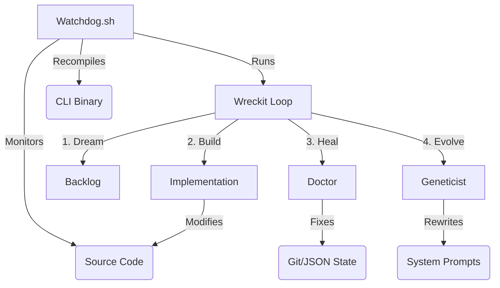

# System Architecture

Wreckit is designed as a **Recursive Autonomous Agent System**. Unlike traditional CLI tools that run once and exit, Wreckit is built to run indefinitely, improving itself over time.

## The Sovereign Stack

### 1. The Supervisor (Watchdog)
*   **File:** `watchdog.sh`
*   **Role:** The "Nervous System".
*   **Function:** It is a bash script that wraps the Node.js process. It calculates hashes of the `src/` directory. If the code changes (e.g., the agent refactors itself), the Watchdog kills the process, runs `npm run build`, and restarts the CLI.

### 2. The Immune System (Doctor)
*   **File:** `src/doctor.ts`
*   **Role:** Self-Healing.
*   **Function:** Runs before every item. Checks for:
    *   **Dirty Git State:** Stashes uncommitted changes that block branch switching.
    *   **Corrupted JSON:** Repairs broken `item.json` or `prd.json`.
    *   **Stale Locks:** Clears dead process locks.

### 3. The Brain (Geneticist)
*   **File:** `src/commands/geneticist.ts`
*   **Role:** Cognitive Evolution.
*   **Function:**
    *   Reads `.wreckit/healing-log.jsonl`.
    *   Identifies recurring failure patterns (e.g., "Agent always forgets tests").
    *   **Mutates** the system prompts (`src/prompts/implement.md`) to include counter-measures.
    *   Submits a PR to apply the improved prompt.

### 4. The Hands (Factory)
*   **File:** `src/commands/implement.ts`
*   **Role:** Execution.
*   **Function:** The standard "Ralph Wiggum Loop" (Research -> Plan -> Implement -> PR).

## Data Flow

1.  **Dreamer** scans code -> Creates `item.json`.
2.  **Orchestrator** picks item -> Runs Agents.
3.  **Agent** modifies code -> `watchdog` detects change.
4.  **Watchdog** rebuilds binary -> New code is live.

This architecture allows Wreckit to be **Sovereign**: it does not depend on the user to update it. It updates itself.
